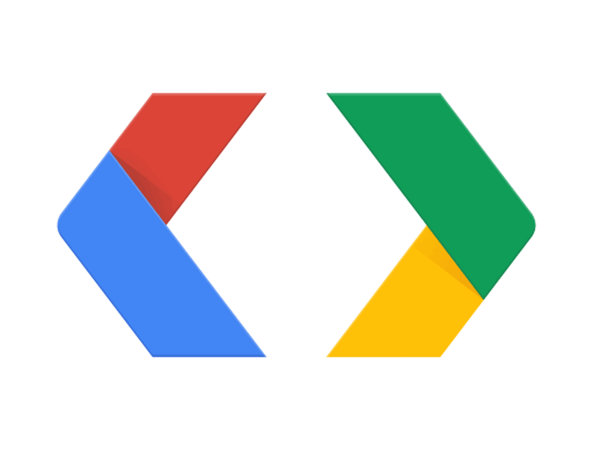

Welcome to The Bifrost's documentation!
=======================================

A bridge for your data structures 
-------------------------------------------------------------------------------------

The Bifrost is currently a platform suite of scripts libraries based on `Google Protocol Buffers (protobufs) <https://protobuf.dev/>`_ designed to connect data structures across different programming languages.

Building a system using protobufs can be a game-changer for developers and organizations. It makes building distributed systems much simpler because it provides a common data
interchange format that can be used across different parts of the system.
This means you won't have to write a lot of code to handle data conversion and serialization/deserialization.

In addition, using more mature versions of our current suite will improve application performance and efficiency. 
This is because our use of protobufs reduce the size of data transferred over the network, which can significantly improve data transfer speeds.
The fact that protobufs have standardized data formats also improve the reliability of data transfers between different systems. 
It makes it easier to understand and validate data, which can help prevent errors and improve overall system stability.

Building this system, based on Google Protocol Buffers, can be an incredibly useful tool for modern software developers. 
It has the potential to simplify building distributed systems, improve application performance and efficiency, and provide
a reliable and standardized data interchange format that can be used across different systems.

Check out the :doc:`usage` section for further information, including how to :ref:`installation` the project. 

.. note::

   This project is under development and currently on its nascent stages. Open-source contributors are more than welcome for collaborations. 

Contents
--------

.. toctree::

   usage
   api
   python
   