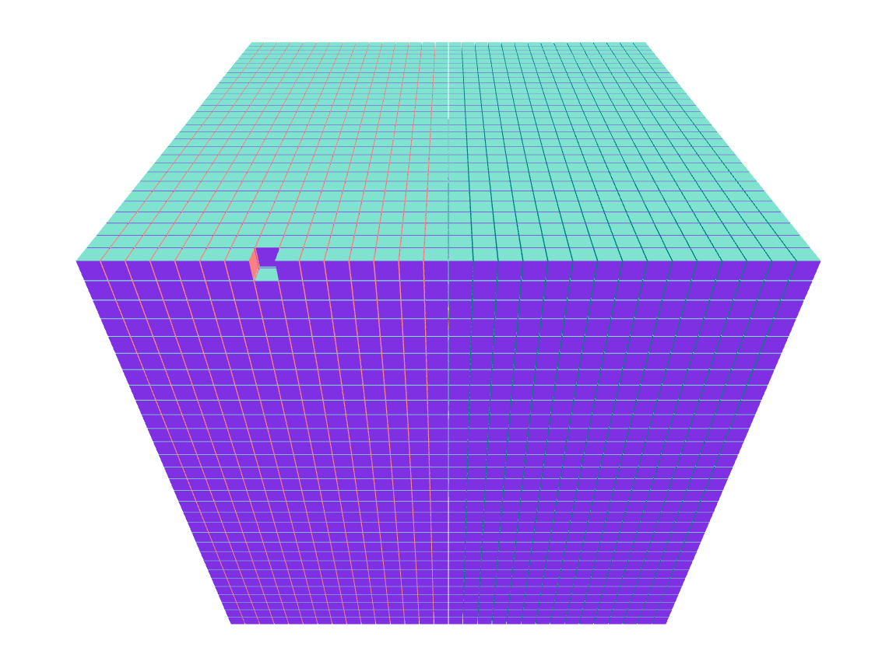

Python
=========

Writing and Reading 3-D Arrays using Protocol Buffers in Python
--------------------------------------------------------------------

Protocol Buffers (protobuf) is a language- and platform-neutral data serialization format developed by Google. 
In this tutorial, we will show you how to use protobuf to write and read 3-D arrays in Python. We will also demonstrate how to convert the resulting protobuf objects into 3-D numpy arrays for further processing.

Memory Savings
.................

A 30x30x30 dense array stored as a protobuf object occupies only **31 kB** of memory. 
In contrast, the same array saved as a coordinate matrix in "zyxa" format consumes approximately **320 kB** of memory, 
which is over 10 times more than the protobuf object. This demonstrates the efficiency of protocol buffers in terms of memory usage.

\*z,y,x for coordinates, a for entry value

Requirements
.................

Before we begin, make sure that you have protobuf installed in your Python environment. You can install it via pip by running:

.. code-block:: bash

  pip install protobuf

Writing a 3-D Array to a protobuf File
..............................................

First, we need to define a protobuf message that represents a 3-D numeric tensor. 
We have drafted a file to do this and named it `tensors.proto <https://raw.githubusercontent.com/andrewrgarcia/bifrost/main/proto/tensors.proto>`_:

.. code-block:: bash

  syntax = "proto3";

  message NumTensor {
    repeated NumMatrix my_arrays = 1;
  }

  message NumMatrix {
    repeated NumRow my_sub_arrays = 1;
  }

  message NumRow {
    repeated int32 my_array = 1 [packed=true];
  }

This definition specifies a NumTensor message that contains a repeated field of NumMatrix messages,
each of which contains a repeated field of NumRow messages. The NumRow message simply holds a 1-D array of int32 values.

After this we must compile our *.proto* file to python format. This is done by running the `compile.sh <https://raw.githubusercontent.com/andrewrgarcia/bifrost/main/compile.sh>`_ file in the main github directory of this platform: 

.. code-block:: bash

  bash compile.sh python

Next, let's write a Python script that creates a 3-D numpy array and populates the corresponding protobuf message fields. 
The script then writes the serialized message to a file in binary format. Here's an example implementation taken 
from our `tensors_port.py <https://raw.githubusercontent.com/andrewrgarcia/bifrost/main/src/python/tensors_port.py>`_ code:

.. code-block:: python

  import proto.tensors_pb2 as protoTensors
  import numpy as np

  'declare a numeric tensor from `NumTensor` protobuf'
  tensor_3d = protoTensors.NumTensor()

  #This is a 3-D tensor with random numbers between 0 - 99
  tensor = np.random.randint(0,100,(3,3,3))
  Z,Y,X = tensor.shape

  'populate fields of protobuf object'
  for i in range(Z):
      my_array = tensor_3d.my_arrays.add()
      for j in range(Y):
          my_sub_array = my_array.my_sub_arrays.add()
          for k in range(X):
              my_sub_array.my_array.append(tensor[i,j,k])

  print(tensor_3d)

  with open("tensor.bin", "wb") as f:
      f.write(tensor_3d.SerializeToString())

In this example, we first create a 3-D numpy array tensor with random integer values between 0 and 99. We then create a NumTensor protobuf message tensor_3d and populate its fields by iterating over the tensor array and appending its values to the corresponding NumRow fields.

Finally, we serialize the tensor_3d message into a binary string using the SerializeToString() method and write it to a file named "tensor.bin" using the open() and write() functions.

Reading a 3-D Array from a protobuf File
..................................................

Now that we have written a 3-D numpy array to a protobuf file, let's demonstrate how to read it back into a numpy array. We first need to parse the binary string in the file into a NumTensor protobuf message, and then we can extract the values and create a 3-D numpy array.

Here's an example implementation that can be found in our `tensors_load.py <https://raw.githubusercontent.com/andrewrgarcia/bifrost/main/src/python/tensors_load.py>`_ code:

.. code-block:: python

  import proto.tensors_pb2 as protoTensors
  import numpy as np

  # Load the serialized tensor from file
  with open("tensor.bin", "rb") as f:
      serialized_tensor = f.read()

  # Parse the serialized tensor into a NumTensor protobuf object
  tensor_3d = protoTensors.NumTensor()
  tensor_3d.ParseFromString(serialized_tensor)

  # Unpack the NumTensor protobuf object into a 3-D numpy array
  my_array = tensor_3d.my_arrays[0]  # get first my_array
  Z, Y, X = len(tensor_3d.my_arrays), len(my_array.my_sub_arrays), len(my_array.my_sub_arrays[0].my_array)
  tensor = np.zeros((Z, Y, X), dtype=np.int32)

  for i in range(Z):
      my_array = tensor_3d.my_arrays[i]
      for j in range(Y):
          my_sub_array = my_array.my_sub_arrays[j]
          for k in range(X):
              tensor[i,j,k] = my_sub_array.my_array[k]

  print(tensor)

This approach allows for efficient serialization and deserialization of large multidimensional arrays.
Additionally, because protobuf messages are platform-independent, the same file can be read by any other programming 
language that supports protobuf. In particular, the above code can be easily adapted to work with other numpy arrays 
of any dimensions.

