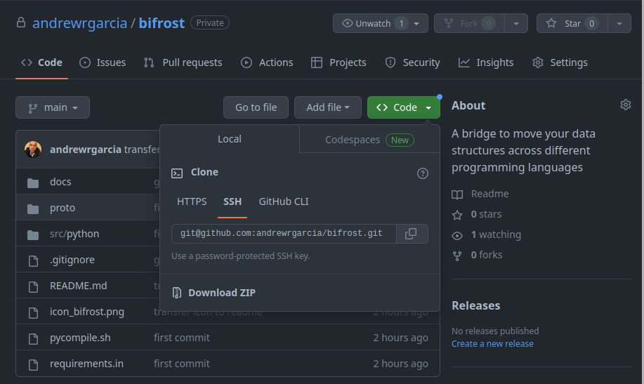

Usage
=====

.. _installation:

Installation
------------

Due to the early stage of development of the project, we recommend that you clone the repository [using SSH] and manually review the scripts using a text editor.
This will allow you to have greater control over the code and ensure that you understand any changes or modifications that are made to the project.

 
.. code-block:: console
   
   $ # Clone the repository and change dir (cd) to cloned repo
   $ git clone git@github.com:username/bifrost.git
   $ cd bifrost
   $ # Open the repository in your preferred text editor 
   $ code .   #if using Visual Studio Code

If you're unfamiliar with terminal commands, here are more graphical-friendly instructions.

To clone the Bifrost repository, first navigate to the GitHub repository website using your web browser. 
Once you're in the repository, look for a green button labeled "Clone" on the right-hand side of the page. Click on this button to reveal a dropdown menu.

In the dropdown menu, you'll see a few options for cloning the repository.
Select the one that says "HTTPS" if you're unfamiliar with the other options. Then, copy the provided code that appears in the box next to the "HTTPS" option.

Next, open up your terminal or Git shell on your computer. In the terminal, navigate to the directory where you'd like to clone the repository (for example, ``~/Documents/``).

Once you're in the desired directory, paste the code you copied from the GitHub website into your terminal and press enter.
This will initiate the cloning process, and the Bifrost repository will be copied to your local machine for you to access and work with.

After this, proceed by installing libprotobuf-dev, which is a package in Ubuntu that provides the development files for the 
Google Protocol Buffers library. The package includes header files, static libraries, and other resources necessary for 
developing software that uses Google Protocol Buffers:

.. code-block:: console

  sudo apt install libprotobuf-dev

Python
.......

.. code-block:: console

  pip install -r requirements.in 

Functional Organization Structure
--------------------------------------

The Bifrost project has a well-designed project structure that is both lean and functional. 
At the highest level, we have high-level scripts such as compile.sh to manage the project. The ``proto/`` directory contains all the Protobuf schemas used to define data structures, 
while the ``src/`` directory houses the source code for running these data structures. 

To keep things organized, the ``src/`` directory is divided into subdirectories for different programming languages. 
Additionally, the ``tests/`` directory has the same organizational structure as src, but is dedicated to test scripts for ensuring the system operates as expected. 
This structure enables us to navigate and organize the project with ease, which is crucial for software development.

.. code-block:: bash

   bifrost/
   ├── compile.sh
   ├── proto/
   │   ├── schema1.proto
   │   ├── schema2.proto
   │   ├── ...
   │   └── schemaN.proto
   ├── src/
   │   ├── python/
   │   │   ├── module1.py
   │   │   ├── module2.py
   │   │   ├── ...
   │   │   └── moduleN.py
   │   ├── javascript/
   │   ├── cpp/
   │   ├── java/
   │   ├── go/
   │   └── ...
   ├── tests/
   │   ├── python/
   │   ├── javascript/
   │   ├── cpp/
   │   ├── java/
   │   ├── go/
   │   └── ...
   └── ...

Easy Compiling 
---------------------

We have made a simple shell script based on the protobuf `tutorials <https://protobuf.dev/getting-started/>`_ to compile our protobuf files in the ``bifrost/proto`` directory. To compile the 
``.proto`` files to any language, simply execute the ``compile.sh`` script followed by the name of the programming language you wish to compile the protobuf file to. 

For example, if you would like to compile all these files to cpp, type:

>>> bash compile.sh cpp

To do so in Python, type:

>>> bash compile.sh python

After running these 2 commands, cpp- and python-compatible compiled data structure files will be generated in new ``proto/`` directories to those languages housed within the ``src/`` folder, as below:

.. code-block:: bash

   bifrost/
   │   ...
   ├── src/
   │   ├── python/
   │   │   ├── proto/
   │   │   ├── ...
   │   ├── cpp/
   │   │   ├── proto/
   │   │   ├── ...
   │   └── ...
   └── ...

The Proto Files 
-------------------

So far, we have created two Protobuf schemas, which are designed to facilitate the transfer of data structures between different programming languages. 
These schemas specify the structure and data type of the information being transferred, enabling it to be defined in any language that supports Protobuf. 

The first schema we designed handles a container called **Object** which consists of a string field and a one-dimensional array. It's worth noting that the different fields in this container must be indexed for easy access and manipulation.

.. code-block:: protobuf

   syntax = "proto3";

   message Object {
   string string_field = 1;
   repeated int32 array_field = 2;
   }

The second schema we developed was created to handle a third-order numerical tensor called **NumTensor**. This schema was developed to support the author's interest in representing three-dimensional objects mathematically. The **NumTensor** schema allows for the efficient storage and manipulation of numerical data in a three-dimensional format, making it useful for a wide range of applications.

.. code-block:: protobuf

   syntax = "proto3";

   message NumTensor {
   repeated NumMatrix my_arrays = 1;
   }

   message NumMatrix {
   repeated NumRow my_sub_arrays = 1;
   }

   message NumRow {
   repeated int32 my_array = 1 [packed=true];
   }

By using a programming language that supports Protobuf, we can easily create data structures based on the schemas we have defined. 
To create an **Object** container and a **NumTensor** tensor with Python, we may call the relevant functions in the ``src`` directory housing the ``Python`` scripts, 
which pass the necessary parameters as specified by our Protobuf schema.

The first function call is to a script which takes the **Object** object from ``proto/object.proto``, defining the string field as `hello world` and the array field as a list from 0 to 9: 

>>> python src/python/message.py 
string_field: "hello world"
array_field: 0
array_field: 1
array_field: 2
array_field: 3
array_field: 4
array_field: 5
array_field: 6
array_field: 7
array_field: 8
array_field: 9

The second function call applies the **NumTensor** object from the ``proto/tensors.proto`` file to make a 3x3x3 tensor with random numbers from 0 to 99:

>>> python src/python/num_tensors.py 
my_arrays {
  my_sub_arrays {
    my_array: 66
    my_array: 43
    my_array: 51
  }
  my_sub_arrays {
    my_array: 1
    my_array: 30
    my_array: 72
  }
  my_sub_arrays {
    my_array: 50
    my_array: 41
    my_array: 20
  }
}
my_arrays {
  my_sub_arrays {
    my_array: 91
    my_array: 88
    my_array: 69
  }
  my_sub_arrays {
    my_array: 6
    my_array: 43
    my_array: 23
  }
  my_sub_arrays {
    my_array: 38
    my_array: 39
    my_array: 85
  }
}
my_arrays {
  my_sub_arrays {
    my_array: 20
    my_array: 69
    my_array: 94
  }
  my_sub_arrays {
    my_array: 35
    my_array: 91
    my_array: 5
  }
  my_sub_arrays {
    my_array: 34
    my_array: 81
    my_array: 15
  }
}

